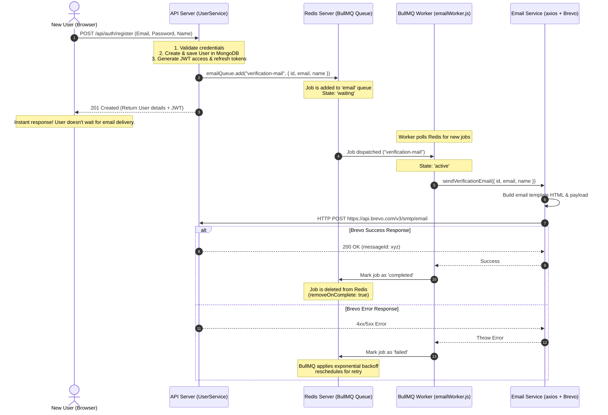

# Integrating BullMQ Message Queue for Email Delivery

This guide provides a step-by-step walkthrough on how to replicate the project's codebase architecture and folder structure to set up a BullMQ-based message queue service in any other Node.js/Express project. 

For simplicity, this guide is customized for a single email flow: sending the **Welcome Email** (`sendWelcomeEmail.js`).

---

## 📂 Codebase Architecture & Folder Structure

To maintain consistency with the current codebase, the target project should follow this structure:

```text
your-project-root/
├── .env
├── package.json
├── server.js (Application entrypoint)
└── src/
    ├── app.js
    ├── config/
    │   └── config/
    │       └── bullmq-connection.js
    ├── queues/
    │   └── emailQueue.js
    ├── services/
    │   └── sendMailServices/
    │       ├── constants.js
    │       └── sendWelcomeEmail.js
    ├── utils/
    │   └── logger.js
    └── workers/
        └── emailWorker.js
```

---

## 📋 List of Files to Create

Here are the 6 files you need to create/modify to implement the message queue:

1. `src/config/config/bullmq-connection.js` — Redis connection config for BullMQ.
2. `src/services/sendMailServices/constants.js` — Email styling & asset constants.
3. `src/services/sendMailServices/sendWelcomeEmail.js` — Mail provider integration logic.
4. `src/queues/emailQueue.js` — BullMQ Queue definition.
5. `src/workers/emailWorker.js` — BullMQ Worker to process queued jobs.
6. `server.js` — The application entrypoint to launch the worker.

---

## 🛠️ Step-by-Step Implementation Guide

### Step 1: Install Dependencies
Install the required packages in your new project:
```bash
npm install bullmq axios dotenv winston
```
*   `bullmq`: Message queue library.
*   `axios`: For sending HTTP requests to the Brevo API.
*   `dotenv`: For environment variable management.
*   `winston`: Optional, but used in the current codebase for logging.

---

### Step 2: Configure Environment Variables (`.env`)
Add the Redis credentials and Brevo API details to your `.env` file:
```env
PORT=3000
REDIS_HOST=localhost
REDIS_PORT=6379
REDIS_PASSWORD=

# Brevo (formerly Sendinblue) Configuration
BREVO_API_KEY=your_brevo_api_key_here
```

---

### Step 3: Define Redis Connection Config
Create the BullMQ Redis connection configuration file.

**File:** [bullmq-connection.js](file:///src/config/config/bullmq-connection.js)
```javascript
// src/config/config/bullmq-connection.js

const connection = {
  host: process.env.REDIS_HOST || "localhost",
  port: Number(process.env.REDIS_PORT) || 6379,
  password: process.env.REDIS_PASSWORD || undefined,
};

export default connection;
```

---

### Step 4: Create Email Constants
Create the helper file containing the logo URL and email styling rules.

**File:** [constants.js](file:///src/services/sendMailServices/constants.js)
```javascript
// src/services/sendMailServices/constants.js

export const logoUrl = "https://ik.imagekit.io/sheryians/favicon_FuNGo5cLy.webp";

export const email_style = `
<style>
  @media only screen and (max-width: 480px) {
    .logo-img {
      margin-right: 8px !important;
    }
  }
</style>
`;
```

---

### Step 5: Implement the Welcome Email Service
Implement the core service that makes the Brevo API call to send the email.

**File:** [sendWelcomeEmail.js](file:///src/services/sendMailServices/sendWelcomeEmail.js)
```javascript
// src/services/sendMailServices/sendWelcomeEmail.js
import axios from "axios";
import { email_style, logoUrl } from "./constants.js";

const FRONTEND_URL = "https://hire.sheryians.com";
const BREVO_API_KEY = process.env.BREVO_API_KEY;
const BREVO_URL = "https://api.brevo.com/v3/smtp/email";

/**
 * Send welcome email after job application
 * @param {Object} data - Contains recipient info (to, name, jobTitle, appliedAt)
 */
export async function sendWelcomeEmail(data) {
  try {
    const payload = {
      sender: { name: "Sheryians Recruitment", email: "hr@sheryians.com" },
      to: [{ email: data.to, name: data.name || "Candidate" }],
      subject: `Application Received: ${data.jobTitle || "Job Position"}`,

      htmlContent: `
      ${email_style}
<div style="font-family: 'Inter', system-ui, -apple-system, sans-serif; background-color: #f8fafc; padding: 40px 10px;">
  <div style="max-width: 540px; margin: 0 auto; background: #ffffff; border-radius: 16px; overflow: hidden; box-shadow: 0 4px 20px rgba(0,0,0,0.03); border: 1px solid #e2e8f0;">
    
    <div style="background: #000000; padding: 32px 20px; text-align: center;">
      <table role="presentation" cellspacing="0" cellpadding="0" border="0" style="margin: auto;">
        <tr>
          <td style="vertical-align: middle;">
            
          </td>
          <td style="vertical-align: middle;">
            <span style="color: #ffffff; font-size: 22px; font-weight: 700; letter-spacing: -0.5px; line-height: 1;">Sheryians.</span>
          </td>
        </tr>
      </table>
    </div>

    <div style="padding: 40px 32px;">
      <h1 style="font-size: 24px; font-weight: 700; color: #1e293b; margin: 0 0 16px; letter-spacing: -0.5px;">
        Application Received
      </h1>
      
      <p style="font-size: 15px; line-height: 1.6; color: #475569; margin: 0 0 24px;">
        Hello ${data.name || "Candidate"},<br/><br/>
        Thank you for applying for the <strong style="color: #1e293b;">${data.jobTitle}</strong> position. We have successfully received your application and our recruitment team is currently reviewing it.
      </p>

      <div style="background: #f1f5f9; border-radius: 8px; padding: 20px; border-left: 4px solid #000000; margin-bottom: 24px;">
        <p style="margin: 0; font-size: 13px; color: #64748b; font-weight: 600; text-transform: uppercase; letter-spacing: 0.05em;">
          Position Applied For
        </p>
        <p style="margin: 8px 0 0; font-size: 16px; color: #1e293b; font-weight: 600;">
          ${data.jobTitle}
        </p>
        <p style="margin: 8px 0 0; font-size: 13px; color: #64748b;">
          Applied on: ${new Date(data.appliedAt).toLocaleString()}
        </p>
      </div>

      <p style="font-size: 14px; color: #475569; line-height: 1.6; margin-bottom: 24px;">
        If your profile matches our requirements, you will be contacted for the next steps in the hiring process.
      </p>

      <div style="text-align: center; margin: 32px 0;">
        <a href="${FRONTEND_URL}"
           style="
             display: inline-block;
             background-color: #2563eb;
             color: #ffffff;
             padding: 14px 32px;
             font-size: 15px;
             font-weight: 600;
             text-decoration: none;
             border-radius: 8px;
             box-shadow: 0 4px 12px rgba(37, 99, 235, 0.2);
           ">
          Visit Recruitment Portal
        </a>
      </div>
    </div>

    <div style="padding: 32px; border-top: 1px solid #f1f5f9; background-color: #fafafa; text-align: center;">
      <p style="font-size: 13px; color: #64748b; margin: 0;">
        Best regards,<br/>
        <strong style="color: #1e293b;">Sheryians Recruitment Team</strong>
      </p>
      <p style="font-size: 11px; color: #cbd5e1; margin-top: 12px;">
        This is an automated system message. Please do not reply directly to this email.
      </p>
    </div>
  </div>
</div>
`,
      textContent: `
Hello ${data.name || "Candidate"},

Thank you for applying for the ${data.jobTitle} position.
We have received your application and our team is reviewing it.

Applied on: ${new Date(data.appliedAt).toLocaleString()}

Regards,
Sheryians Recruitment Team
  `,
    };

    const response = await axios.post(BREVO_URL, payload, {
      headers: {
        "api-key": BREVO_API_KEY,
        "Content-Type": "application/json",
      },
    });

    console.log("WELCOME EMAIL SENT:", response.data.messageId);
    return response.data;
  } catch (error) {
    console.error("Brevo welcome email failed:", {
      message: error.message,
      status: error.response?.status,
      data: error.response?.data,
    });
    throw error; // Propagate the error so BullMQ can trigger retries
  }
}
```

---

### Step 6: Initialize the BullMQ Queue
Create the queue instance with default retry configurations.

**File:** [emailQueue.js](file:///src/queues/emailQueue.js)
```javascript
// src/queues/emailQueue.js
import { Queue } from "bullmq";
import connection from "../config/config/bullmq-connection.js";

export const emailQueue = new Queue("email", {
  connection,
  defaultJobOptions: {
    attempts: 3, // Retry up to 3 times on failure
    backoff: {
      type: "exponential",
      delay: 5000, // Wait 5s, 10s, 20s, etc. between retries
    },
    removeOnComplete: true, // Delete job metadata from Redis on success
    removeOnFail: false, // Keep failed jobs in Redis for debugging
  },
});
```

---

### Step 7: Create the BullMQ Worker
Create a worker that listens to the `"email"` queue and processes jobs by invoking the Welcome Email service.

**File:** [emailWorker.js](file:///src/workers/emailWorker.js)
```javascript
// src/workers/emailWorker.js
import { Worker } from "bullmq";
import connection from "../config/config/bullmq-connection.js";
import { sendWelcomeEmail } from "../services/sendMailServices/sendWelcomeEmail.js";

// Optional logger fallback
const logger = console;

const worker = new Worker(
  "email",
  async (job) => {
    logger.info(`Processing job ${job.id} - ${job.name}`);

    try {
      if (job.name === "welcome-candidate") {
        await sendWelcomeEmail(job.data);
      } else {
        logger.warn(`Unknown job type: ${job.name}`);
      }
    } catch (error) {
      logger.error(`Job ${job.id} failed: ${error.message}`);
      throw error; // Throw error to trigger BullMQ's automatic retry logic
    }
  },
  {
    connection,
    concurrency: 5, // Process up to 5 jobs concurrently
  }
);

worker.on("completed", (job) => {
  logger.info(`Job ${job.id} (${job.name}) completed successfully`);
});

worker.on("failed", (job, err) => {
  logger.error(`Job ${job?.id} (${job?.name}) failed: ${err.message}`);
});

worker.on("error", (err) => {
  logger.error("Worker encountered an error:", err);
});

logger.info("BullMQ Email Worker started successfully!");
```

---

### Step 8: Mount the Worker in Server Entrypoint
Import the worker file in `server.js` to ensure it boots up when the server starts.

**File:** [server.js](file:///server.js)
```javascript
// server.js (or index.js)
import express from "express";
import dotenv from "dotenv";
dotenv.config();

// START THE BULLMQ WORKER AUTOMATICALLY BY IMPORTING IT
import "./src/workers/emailWorker.js";

const app = express();
const PORT = process.env.PORT || 3000;

app.listen(PORT, () => {
  console.log(`Server running on http://localhost:${PORT}`);
});
```

---

### Step 9: Queue an Email Job in Your Service
To trigger a welcome email from anywhere in your codebase, import `emailQueue` and queue the job:

```javascript
import { emailQueue } from "../queues/emailQueue.js";

async function handleNewApplication(candidateData) {
  // Save application to database first...
  
  try {
    await emailQueue.add(
      "welcome-candidate",
      {
        to: candidateData.email,
        name: candidateData.firstName || "Candidate",
        jobTitle: candidateData.jobTitle,
        appliedAt: new Date().toISOString(),
        applicationId: candidateData.applicationId,
      }
    );
    console.log(`Welcome email job queued for ${candidateData.email}`);
  } catch (error) {
    console.error("Failed to queue welcome email", error);
  }
}
```

---

## 🔄 First-Time User Registration Flow (Regarding the Queue)

When a new user signs up, the system handles the request **asynchronously** to maximize performance and avoid delaying the client API response. Here is the lifecycle of the queue operations during this process:

### Flow Diagram



### Detailed Execution Steps

1. **Client Request**: A candidate registers by sending a `POST` request with their details.
2. **Synchronous DB Actions**: The API server validates the request, hashes the password, writes the new record to MongoDB, and stores the user data in Redis Cache for speed.
3. **Queue Ingestion**: Instead of calling the SMTP provider directly (which can block the response for 1 to 3 seconds), `UserService.register` invokes `emailQueue.add("verification-mail", { ... })`.
4. **Immediate Client Response**: The API server signs the JWT access and refresh tokens, and immediately sends a `201 Created` response back to the candidate's browser.
5. **Worker Pickup**: Meanwhile, in a separate background execution context, the **BullMQ Worker** (instantiated in `server.js`) detects the new job under the `"email"` queue. It transitions the job state from `waiting` to `active`.
6. **Provider Request**: The worker's handler function executes the corresponding function `sendVerificationEmail(...)` which builds the layout HTML and sends an Axios HTTP request to Brevo.
7. **Job Completion & Cleanup**:
    *   **On Success**: Brevo accepts the request and returns a success status. The worker completes successfully, notifying Redis, which automatically cleans up the job details from memory (`removeOnComplete: true`).
    *   **On Failure**: If Brevo is down or returns an error, the worker catches the error and throws it. BullMQ intercepts the thrown exception, transitions the job state to `delayed`, and schedules a retry according to the exponential backoff config.
